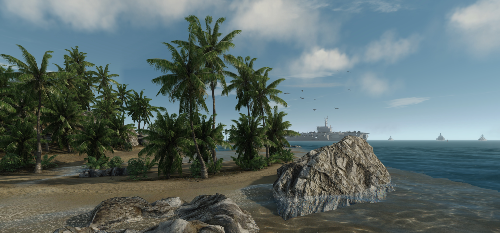

# Proxima Beach
Crysis map based on the famous **CryEngine 2** from Crytek®.

*While Nomad is progressing in the Korean Island, another American unit called SIS (Special Intervantion Squadron) started to surround a small beach on the east of the Korea. The aim of this American attack is to take control of the Island and kill all the KPA units. The SIS rapidly discovered that the Koreans had already acquired the nanosuit technology and some UFO weapons to prepare worldwide invasion.*

## Features
Here you will find some of the features included **in the map**:

1. Time of day
2. Terrain areas
3. Sound areas
4. Prefabs
5. Vehicles
6. Korean bots
7. Flow graphs and triggers (light, shark, etc.)
8. C17 spawning
9. And much more! ...

## Dependencies
If you want to open and edit this map, you need to have **some requirements** setted on your machine.

1. CryEngine Editor called `Sandbox 2.0` required
2. Windows plateform, working fine on `Windows 7`
3. Good 3D graphic card, tested and built with a `Nvidia GeForce GTX 660 Ti` from EVGA (Signature 2)

## Download
The map is always under construction but you can download a release of the map by choosing the one you want in the [release library](https://github.com/xavierfoucrier/proxima-beach/releases).

The version's notation is based on `Semantic versioning`, [https://semver.org](https://semver.org).

## Updates
You can **track the project** on [Github](https://github.com/xavierfoucrier) and/or **follow me** on [Twitter](https://twitter.com/xavierfoucrier).

## License
The project is developed under the **Creative Commons** license with the reference [BY-NC 4.0](https://creativecommons.org/licenses/by-nc/4.0/) which means that you are free to share, copy, distribute, adapt, remix and transmit the work under the following conditions:

- **Attribution**: You must give appropriate credit, provide a link to the license, and indicate if changes were made. You may do so in any reasonable manner, but not in any way that suggests the licensor endorses you or your use.
- **Noncommercial**: You may not use the material for commercial purposes.

See the [full legal code](https://creativecommons.org/licenses/by-nc/4.0/) of the license for more information about your rights.

## Questions?
If you have any questions, please **feel free to contact me!**  
Check out my website at [https://en.xavierfoucrier.fr](https://en.xavierfoucrier.fr).
